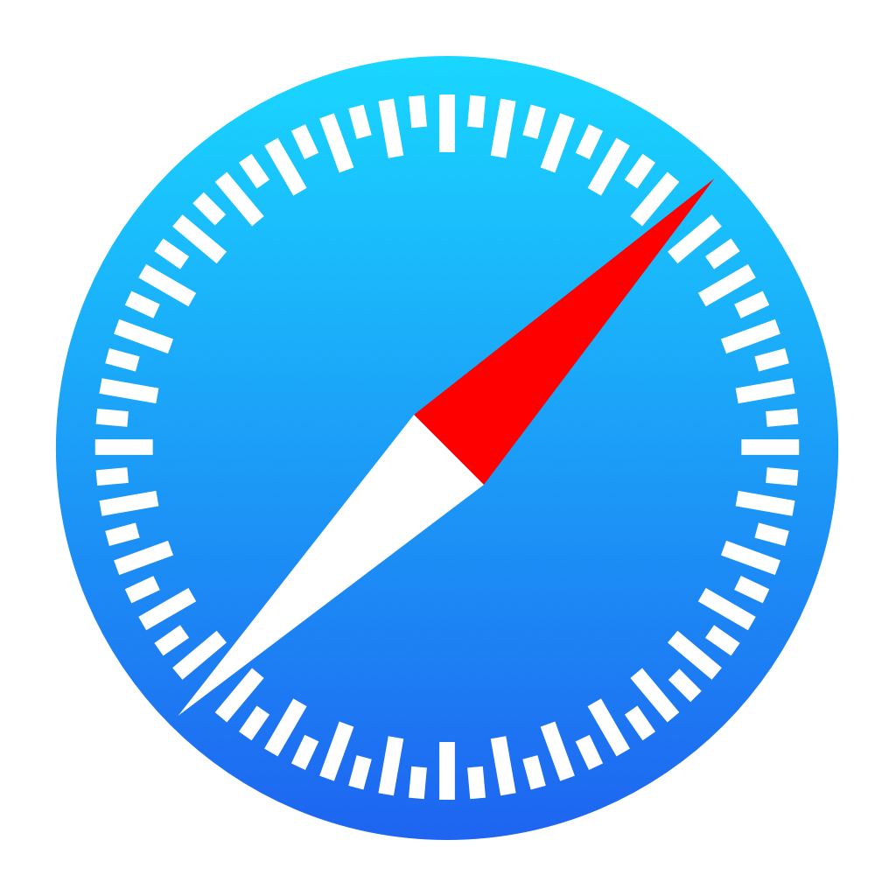

<h1 align="center">
  <br>
    
  <br>
  VS Code - Debugger for iOS Web
  <br>
  <br>
</h1>

<h4 align="center">Debug your JavaScript code running in Safari on iOS devices from VS Code.</h4>

<p align="center">
  <a href="https://travis-ci.com/Microsoft/vscode-ios-web-debug"></a>
  <a href="https://github.com/microsoft/vscode-ios-web-debug/releases"></a>
</p>

Debug your JavaScript code running in Safari on iOS devices from VS Code both on **Windows** and Mac.


**Supported features**
* Setting breakpoints, including in source files when source maps are enabled
* Stepping, including with the buttons on the Chrome page
* The Locals pane
* Debugging eval scripts, script tags, and scripts that are added dynamically
* Watches
* Console

**Unsupported scenarios**
* Debugging web workers
* Any features that aren't script debugging.

## Getting Started

#### Windows
Nothing/ to do as there is a proxy included with the extension from the `vs-libimobile` npm package

#### OSX/Mac
Make sure you have Homebrew installed, and run the following command to install [ios-webkit-debug-proxy](https://github.com/google/ios-webkit-debug-proxy)

```
brew install ios-webkit-debug-proxy
````

## Using the debugger

When your launch config is set up, you can debug your project! Pick a launch config from the dropdown on the Debug pane in Code. Press the play button or F5 to start.

### Configuration 

The extension operates in two modes - it can `launch` an instance of Chrome navigated to your app, or it can `attach` to a running instance of Chrome. Just like when using the Node debugger, you configure these modes with a `.vscode/launch.json` file in the root directory of your project. You can create this file manually, or Code will create one for you if you try to run your project, and it doesn't exist yet.

To use this extension, you must first open the folder containing the project you want to work on.

#### Launch
Two example `launch.json` configs. You must specify either `file` or `url` to launch Chrome against a local file or a url. If you use a url, set `webRoot` to the directory that files are served from. This can be either an absolute path or a path relative to the workspace (the folder open in Code). It's used to resolve urls (like "http://localhost/app.js") to a file on disk (like "/users/me/project/app.js"), so be careful that it's set correctly.
```
{
    "version": "0.1.0",
    "configurations": [
        {
            "name": "Launch localhost with sourcemaps",
            "type": "chrome",
            "request": "launch",
            "url": "http://localhost/mypage.html",
            "webRoot": "${workspaceRoot}/app/files",
            "sourceMaps": true
        },
        {
            "name": "Launch index.html (without sourcemaps)",
            "type": "chrome",
            "request": "launch",
            "file": "${workspaceRoot}/index.html"
        },
    ]
}
```

Launch Chrome and navigate to your page.

An example `launch.json` config.
```
{
    "version": "0.1.0",
    "configurations": [
        {
            "name": "Attach with sourcemaps",
            "type": "chrome",
            "request": "attach",
            "port": 9222,
            "sourceMaps": true
        },
        {
            "name": "Attach to url with files served from ./out",
            "type": "chrome",
            "request": "attach",
            "port": 9222,
            "webRoot": "${workspaceRoot}/out"
        }
    ]
}
```

#### Other optional launch config fields
* diagnosticLogging: When true, the adapter logs its own diagnostic info to the console
* runtimeExecutable: Workspace relative or absolute path to the runtime executable to be used. If not specified, Chrome will be used from the default install location
* runtimeArgs: Optional arguments passed to the runtime executable
* userDataDir: Can be set to a temp directory, then Chrome will use that directory as the user profile directory. If Chrome is already running when you start debugging with a launch config, then the new instance won't start in remote debugging mode. If you don't want to close the original instance, you can set this property and the new instance will correctly be in remote debugging mode.

## Troubleshooting
General things to try if you're having issues:
* Ensure `webRoot` is set correctly if needed
* Look at your sourcemap config carefully. A sourcemap has a path to the source files, and this extension uses that path to find the original source files on disk. Check the `sourceRoot` and `sources` properties in your sourcemap and make sure that they can be combined with the `webRoot` property in your launch config to build the correct path to the original source files.
* This extension ignores sources that are inlined in the sourcemap - you may have a setup that works in Chrome Dev Tools, but not this extension, because the paths are incorrect, but Chrome Dev Tools are reading the inlined source content.
* Close other running instances of Chrome - if Chrome is already running, the extension may not be able to attach, when using launch mode. Chrome can even stay running in the background when all its windows are closed, which will interfere - check the taskbar or kill the process if necessary.
* Ensure nothing else is using port 9222, or specify a different port in your launch config
* Check the console for warnings that this extension prints in some cases when it can't attach
* Ensure the code in Chrome matches the code in Code. Chrome may cache an old version.
* If you were previously using the `cwd` property in your launch config with the `file` property, you need to specify an absolute path for `file` instead, e.g. `"${workspaceRoot}/index.html"`.
* File a bug in this extension's [GitHub repo](https://github.com/Microsoft/vscode-webkit-debug). Set the "diagnosticLogging" field in your launch config and attach the logs when filing a bug.
